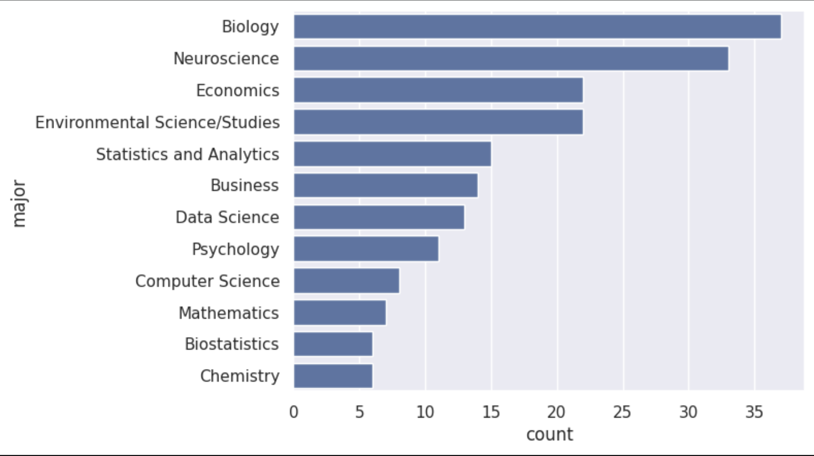
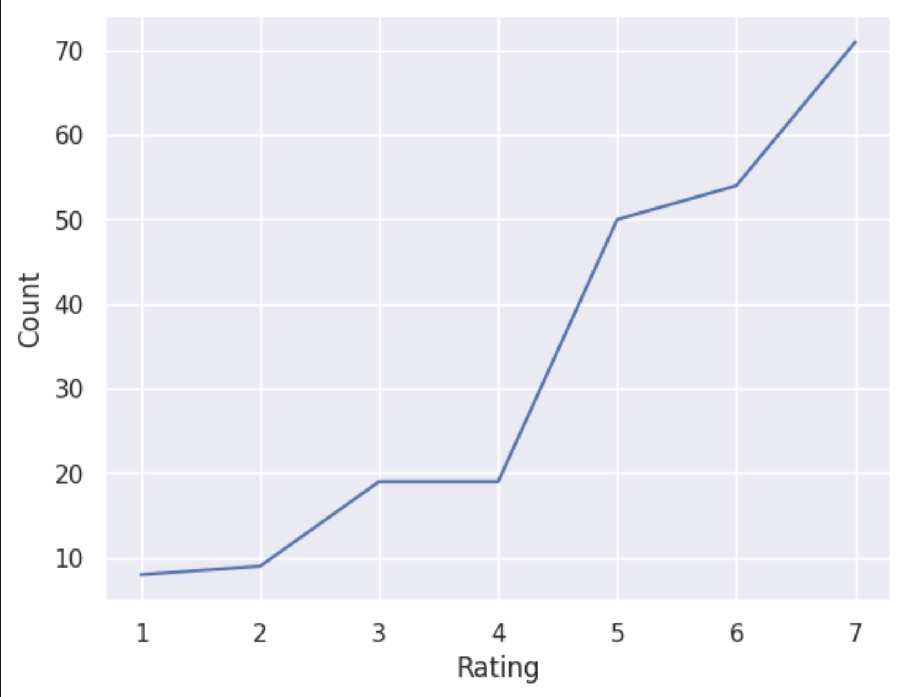
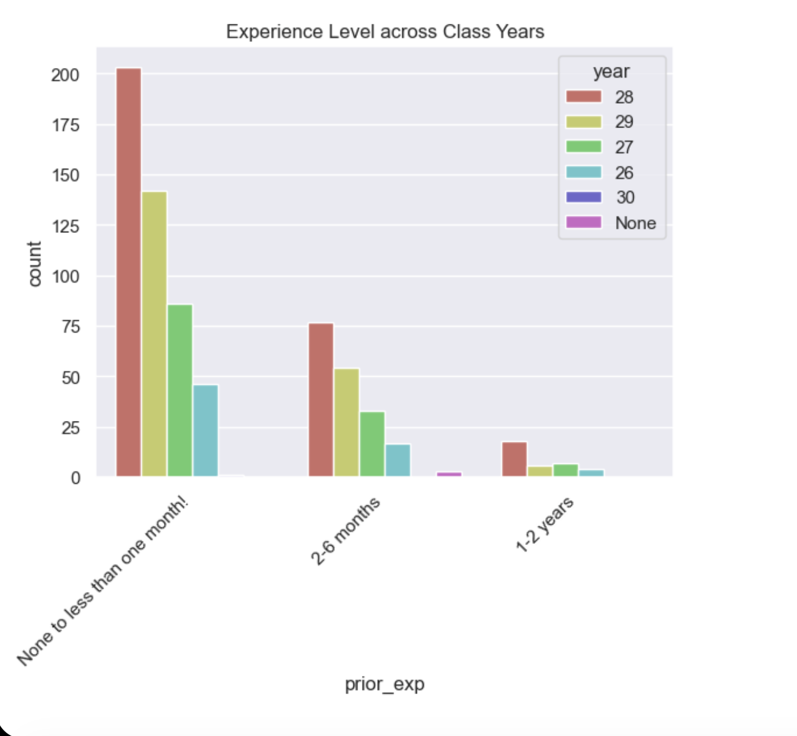
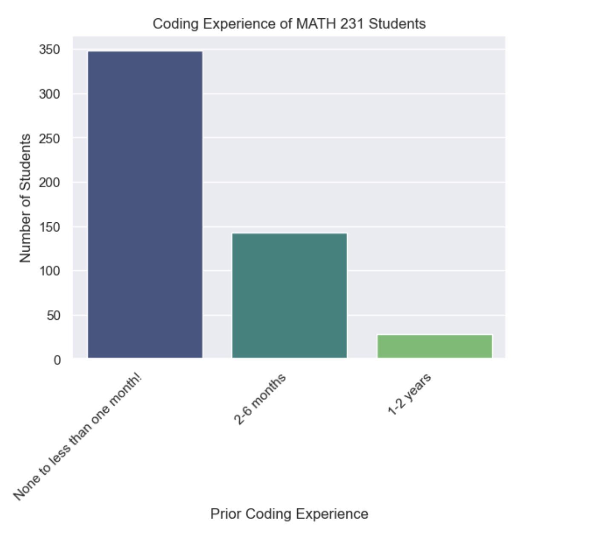

---
# Do not edit the text between these lines!
layout: default
---

# Doing some analysis with COMP 110 data!
### By Priyanka Bhowmik

## Graph one: Finding if more examples should be made for a certain major

<!-- This is a comment. Below, you'll see code for inserting an image. To make this image appear, update <custom-path>. To add an image, save it inside the imgs folder of this repository. -->

### Analysis and conclusion for this graph

This is a graph for the top 10 most popular majors in the class. A majority of the class is biology majors. Hence, having more examples with biology related questions or experiments would help a majority of the students in their future studies in combining biology and computer science. This could involve working with more biology data set. There are some trade-offs. Firstly, biology majors are not an overwhelming majority so just catering examples towards them would mean leaving out students in other fields of studies. A philosophy or a physics major might not really find these helpful.

## Graph two: finding if students think that pre-lecture videos would be helpful

### Analysis and conclusion for this graph:
This is a graph for finding how students rated whether they would find pre-lecture videos helpful. In the graph, we can see that the highest portion of students have responded with a 7. 7 being strongly agree. Hence, it would be helpful for a majority of the students if pre-lecture videos were provided before every class. There is some uncertainity in this data because currently the class does not have pre-lecture videos so, would the graph look the same if it is implemented? With the already heavy workload of this class, how many students would actually watch the videos? It is also a burden for the instructors and TAs to make these. Ultimately, without implementing these changes, it is hard to say whether they would improve the students' performance or not.

# Bridging the Gap: The Logic Workshop
### By Krishna Menon

## The Hypothesis:
My project explores students with advanced mathematical backgrounds transition into introductory Python programming. I hypothesized that many students entering COMP 110 at UNC have the logical foundations from math courses like MATH 231 but lack the specific knowledge to apply that logic.

## Data Visualization:
### The Class Profile
I analyzed survey data from the Class of 2028 to see how prior experience levels compared to math prerequisites. As shown, the vast majority of students entering the course have little to no prior coding experience.

### Testing the Theory
Even when filtering for students who have completed MATH 231 (Calculus 1), the majority still identify as beginners. This proves that mathematical maturity does not automatically equal coding experience.

## Conclusion & Recommendations
The data supports the Math-Coding theory. My analysis found that over 350 students entered the course with high math backgrounds but “None to less than one month” of coding experience.

Recommendation: I propose a “Math-to-Python” logic workshop that leverages students’ existing strengths in Calculus-level logic to accelerate their technical learning.

